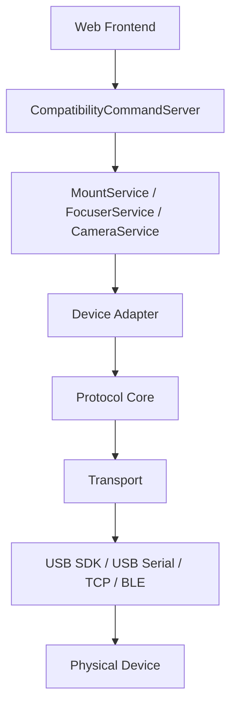

# QUARCS Android 硬件支持统一架构设计

> 适用工程：`/home/q/workspace/QUARCS_app_andorid`
>
> 目标：为 Android 直连硬件建立一套统一、可扩展、可渐进迁移的本地设备支持架构。
>
> 当前样板设备：
> - 赤道仪：`OnStep`
> - 电调焦：`QFocuser`
> - 相机：`QHYCCD`（作为首个验证样板，不作为特殊架构分支）

## 1. 背景

当前 Android 端已经完成前端内嵌、本地 HTTP 服务和本地 WebSocket 兼容命令服务的打通。后续重点不再是“把旧服务端整体搬到 Android”，而是把硬件能力按设备域逐步迁移到 Android 原生实现。

现阶段硬件大体包括：

1. 相机
   - 典型包括厂商 SDK 型 USB 相机，例如 QHYCCD。
2. 非相机硬件
   - 典型包括赤道仪、电调焦、滤镜轮、导星接口等。
   - 过去主要依赖 INDI 生态。

对于 Android 手机直连硬件场景，不建议把相机单独走一套特殊架构，也不建议把 `indiserver + driver + property` 整体搬入 App，而建议统一采用：

- Android 原生连接层
- 精简后的设备协议核心
- 面向设备域的统一相机/赤道仪/调焦接口
- 面向产品业务的统一设备接口
- 与现有 `MountService`、`FocuserService` 及后续 `CameraService` 等服务衔接

## 2. 本文结论

统一架构建议采用以下四层：

1. `Transport` 层
2. `Protocol/Core` 层
3. `Device Adapter` 层
4. `Service` 层

其核心原则是：

- 连接方式与设备协议分离
- 设备协议与产品业务接口分离
- 单一设备核心只负责单一设备域
- 优先抽取 INDI 中有价值的协议逻辑，不复用沉重的设备类外壳
- 与现有前端兼容协议保持衔接，降低迁移风险

## 3. 设计目标

### 3.1 需要解决的问题

- Android 需要直接连接 USB、USB 转串口、Wi-Fi、蓝牙类设备。
- 不同设备厂商的协议差异很大，但上层业务动作高度相似。
- 现有前端已经依赖一批稳定的兼容命令，不适合频繁翻修。
- 后续会持续增加新的赤道仪、调焦器等设备，必须避免“一设备一套架构”。

### 3.2 架构目标

- 为相机、赤道仪和调焦器建立统一的 Android 硬件支持框架。
- 允许不同设备共享连接层、错误模型和状态模型。
- 允许不同品牌设备分别实现自己的协议核心。
- 允许厂商 SDK 型设备也通过统一 `Core + Adapter` 方式接入，而不是绕开整体架构。
- 让 `MountService`、`FocuserService`、`CameraService` 只依赖统一接口，不直接依赖具体品牌实现。
- 支持渐进式接入，先做最小可行能力，再补高级特性。

### 3.3 非目标

- 本文不要求在第一阶段保留 INDI property、面板或 XML 协议。
- 本文不要求第一阶段支持所有 INDI 已支持设备。
- 本文不要求第一阶段实现 OnStep 板载 focuser、rotator、weather 等扩展能力。
- 本文不要求第一阶段完成所有相机高级能力，例如视频流、复杂冷却曲线、厂商特有调试面板。

## 4. 总体分层

### 4.1 逻辑分层图



### 4.2 推荐目录层级

```text
QUARCS_app_andorid/
  hardware/
    transports/
      transport_interface.*
      usb_serial_transport.*
      tcp_transport.*
      ble_transport.*              # 后续可选
    core/
      camera/
        qhyccd/
          qhyccd_camera_sdk.*
          qhyccd_camera_core.*
      mount/
        onstep/
          onstep_mount_protocol.*
          onstep_mount_core.*
      focuser/
        qfocuser/
          qfocuser_protocol.*
          qfocuser_core.*
    adapters/
      camera/
        camera_device_interface.*
        qhyccd_camera_adapter.*
      mount/
        mount_device_interface.*
        onstep_mount_adapter.*
      focuser/
        focuser_device_interface.*
        qfocuser_adapter.*
  services/
    cameraservice.*
    mountservice.*
    focuserservice.*
```

### 4.3 每层职责

#### L1. `Transport`

负责“怎么连接设备”，不负责天文业务语义。

典型职责：

- 打开和关闭连接
- 发送和接收原始数据
- 超时控制
- 缓冲区清理
- 串口参数设置
- USB 权限与热插拔管理
- TCP 重连

典型实现：

- `UsbSdkTransport` 或 `SdkBridgeTransport`
- `UsbSerialTransport`
- `TcpTransport`
- `BleTransport`

不应承担的职责：

- 不解析 RA/DEC
- 不理解 Goto、Park、FocusMove
- 不负责产品级命令返回格式

#### L2. `Protocol/Core`

负责“设备协议和状态机”，不负责 Android 权限与 UI 命令映射。

典型职责：

- 握手
- 命令封包
- 响应解析
- 状态轮询
- 设备能力探测
- 错误码映射
- 设备域核心业务逻辑

典型实现：

- `QhyccdCameraCore`
- `OnStepMountCore`
- `QFocuserCore`

不应承担的职责：

- 不直接依赖 `CameraService`
- 不直接依赖 `MountService` / `FocuserService`
- 不直接依赖 WebSocket 消息结构
- 不直接依赖 Android Activity 生命周期
- 不直接依赖 INDI property 体系

#### L3. `Device Adapter`

负责把具体品牌协议核心转换为产品内部的统一设备接口。

典型职责：

- 把 `QhyccdCameraCore` 暴露为 `ICameraDevice`
- 把 `OnStepMountCore` 暴露为 `IMountDevice`
- 把 `QFocuserCore` 暴露为 `IFocuserDevice`
- 统一状态字段
- 统一错误语义
- 屏蔽底层品牌差异

#### L4. `Service`

负责把产品业务命令转成统一设备接口调用，并返回前端兼容结果。

典型职责：

- `CameraService`
- `MountService`
- `FocuserService`
- 与 `CompatibilityCommandServer` 协作
- 保持现有命令协议风格
- 处理业务级节流、缓存、状态同步

## 5. 横切设计原则

### 5.1 单域单核心

每个设备核心只负责一个设备域：

- `QhyccdCameraCore` 只负责 camera
- `OnStepMountCore` 只负责 mount
- `QFocuserCore` 只负责 focuser

即使某块板子物理上集成了多种能力，也不应在第一阶段把所有能力揉进一个核心类里。

### 5.2 去 INDI 框架化，保留协议价值

对 INDI 的复用策略应为：

- 保留命令格式、响应解析、协议经验、状态机逻辑
- 弃用 `indiserver`
- 弃用 `DefaultDevice`
- 弃用 `INDI::Telescope` / `INDI::Focuser` / `INDI::CCD` 外壳
- 弃用 property / panel / XML 风格接口

换言之：

- 复用 `core`
- 不复用 `shell`

### 5.3 统一错误语义

建议产品内统一错误模型，例如：

- `PermissionDenied`
- `DeviceNotFound`
- `OpenFailed`
- `HandshakeFailed`
- `Timeout`
- `ProtocolError`
- `Unsupported`
- `Busy`
- `Disconnected`

这样 `Service` 层不需要为每个品牌写一套错误翻译。

### 5.4 状态优先于命令回显

上层服务不应只依赖“命令是否发送成功”，还应维护明确的设备状态快照。

建议统一维护：

- 连接状态
- 最近错误
- 最近轮询时间
- 当前目标值
- 当前实际值
- 当前是否忙碌

## 6. `OnStep` 统一样板设计

### 6.1 设计定位

将 `OnStep` 收敛为单一赤道仪样板：

- 名称建议：`OnStepMountCore`
- 第一阶段只覆盖 mount 能力
- 不实现板载 focuser、rotator、weather、outputs 等扩展

### 6.2 为什么要提纯

现有 `lx200_OnStep` 的复杂度主要来自两部分历史原因：

1. 协议上复用了 `LX200` 体系，因此继承链深，带入了大量历史代码。
2. 硬件侧承载了多个设备域，导致一个驱动同时包含 mount、focuser、rotator、weather 等职责。

对 Android 直连场景而言，这种结构过重，不利于：

- 控制继承关系
- 划清职责边界
- 稳定调试
- 渐进演进

### 6.3 推荐保留的核心能力

第一阶段建议只保留：

- `connect`
- `handshake`
- `getVersion`
- `getRaDec`
- `getMountStatus`
- `gotoRaDec`
- `syncRaDec`
- `park`
- `unpark`
- `abort`
- `moveNorthSouth`
- `moveEastWest`
- `setTrackingEnabled`
- `setSlewRate`
- `setGuideRate`（可选）

### 6.4 第一阶段暂不纳入

- 板载 focuser
- rotator
- weather
- outputs
- alignment 高级配置
- 多 focuser 探测
- 各类面向 INDI/Ekos 的扩展属性

### 6.5 `OnStep` 核心拆分建议

```text
OnStepMountCore
  ├─ uses OnStepMountProtocol
  ├─ uses ITransport
  └─ exposes IMountDevice semantics
```

建议职责划分如下：

- `OnStepMountProtocol`
  - 拼接 `:G...#`、`:S...#`、`:M...#` 等命令
  - 解析单字符、整数、浮点、长文本响应
- `OnStepMountCore`
  - 维护当前状态
  - 调度轮询
  - 处理握手和版本判定
  - 提供 mount 级动作接口
- `OnStepMountAdapter`
  - 实现 `IMountDevice`
  - 对接 `MountService`

### 6.6 对 INDI 代码的复用策略

建议复用：

- 命令格式
- 响应解析 helper
- 状态判定经验
- 与 `LX200` 协议兼容的有效命令

不建议复用：

- `LX200Generic`
- `LX200Telescope`
- `INDI::Telescope`
- `WeatherInterface`
- `RotatorInterface`
- 现有 property 定义逻辑

## 7. `QFocuser` 统一样板设计

### 7.1 设计定位

将 `QFocuser` 作为标准单一电调样板：

- 名称建议：`QFocuserCore`
- 第一阶段走单设备、单协议、单设备域路线
- 主要承载 focuser 能力

### 7.2 为什么适合作为样板

`QFocuser` 的协议集中、边界清晰，非常适合作为 Android 原生硬件支持的模板案例：

- 命令封包明确
- JSON 响应结构稳定
- 串口交互模式单纯
- 业务动作集中在 focuser 语义上

### 7.3 推荐保留的核心能力

- `connect`
- `handshake`
- `getVersion`
- `getPosition`
- `moveAbsolute`
- `moveRelative`
- `abort`
- `syncPosition`
- `setSpeed`
- `setReverse`
- `getTemperature`（可选）

### 7.4 第一阶段可后置能力

- hold current
- PDN mode
- 更细的温度显示选项
- 一切偏面板配置性质的扩展项

### 7.5 `QFocuser` 核心拆分建议

```text
QFocuserCore
  ├─ uses QFocuserProtocol
  ├─ uses ITransport
  └─ exposes IFocuserDevice semantics
```

建议职责划分如下：

- `QFocuserProtocol`
  - 生成 JSON 命令
  - 解析 JSON 响应
  - 统一命令编号语义
- `QFocuserCore`
  - 维护目标位置与当前状态
  - 处理握手
  - 执行相对/绝对移动
  - 管理轮询
- `QFocuserAdapter`
  - 实现 `IFocuserDevice`
  - 对接 `FocuserService`

### 7.6 对 INDI 代码的复用策略

建议复用：

- JSON 命令构造逻辑
- 响应字段语义
- 握手和轮询经验
- 位置/速度/同步/反向语义

不建议复用：

- `INDI::Focuser`
- `FocuserInterface`
- property 定义和状态同步逻辑
- `TimerHit`
- 依赖 `PortFD + tty_*` 的直接串口层

## 8. 统一设备接口建议

## 8.1 `ICameraDevice`

建议统一接口如下：

```cpp
enum class CameraExposureState {
    Idle,
    Exposing,
    ReadingOut,
    Downloading,
    Error
};

struct CameraFrameSpec {
    int x;
    int y;
    int width;
    int height;
    int binX;
    int binY;
};

struct CameraState {
    bool connected;
    bool exposing;
    bool coolerSupported;
    bool coolerEnabled;
    bool hasShutter;
    double exposureSeconds;
    double sensorTemperature;
    double targetTemperature;
    int gain;
    int offset;
    CameraExposureState exposureState;
    QString lastError;
};

class ICameraDevice {
public:
    virtual ~ICameraDevice() = default;
    virtual bool connect() = 0;
    virtual void disconnect() = 0;
    virtual CameraState state() const = 0;
    virtual bool startExposure(double seconds, bool lightFrame) = 0;
    virtual bool abortExposure() = 0;
    virtual bool readoutFrame(QByteArray &buffer) = 0;
    virtual bool setGain(int gain) = 0;
    virtual bool setOffset(int offset) = 0;
    virtual bool setFrameSpec(const CameraFrameSpec &spec) = 0;
    virtual bool setCoolerEnabled(bool enabled) = 0;
    virtual bool setTargetTemperature(double celsius) = 0;
};
```

说明：

- `ICameraDevice` 只暴露产品需要的统一相机能力。
- 底层可以是厂商 SDK，也可以是未来从 INDI/原驱动中提纯出来的协议核心。
- `QHYCCD` 在第一阶段作为 `QhyccdCameraCore + QhyccdCameraAdapter` 接入，用来验证该抽象是否足够稳定。

## 8.2 `IMountDevice`

建议统一接口如下：

```cpp
struct MountState {
    bool connected;
    bool slewing;
    bool tracking;
    bool parked;
    double raHours;
    double decDegrees;
    double targetRaHours;
    double targetDecDegrees;
    QString lastError;
};

class IMountDevice {
public:
    virtual ~IMountDevice() = default;
    virtual bool connect() = 0;
    virtual void disconnect() = 0;
    virtual MountState state() const = 0;
    virtual bool gotoRaDec(double raHours, double decDegrees) = 0;
    virtual bool syncRaDec(double raHours, double decDegrees) = 0;
    virtual bool park() = 0;
    virtual bool unpark() = 0;
    virtual bool abort() = 0;
    virtual bool setTrackingEnabled(bool enabled) = 0;
    virtual bool moveNorthSouth(bool north, bool start) = 0;
    virtual bool moveEastWest(bool east, bool start) = 0;
};
```

## 8.3 `IFocuserDevice`

建议统一接口如下：

```cpp
struct FocuserState {
    bool connected;
    bool moving;
    int position;
    int targetPosition;
    int speed;
    bool reversed;
    double temperature;
    QString lastError;
};

class IFocuserDevice {
public:
    virtual ~IFocuserDevice() = default;
    virtual bool connect() = 0;
    virtual void disconnect() = 0;
    virtual FocuserState state() const = 0;
    virtual bool moveAbsolute(int position) = 0;
    virtual bool moveRelative(bool outward, int steps) = 0;
    virtual bool abort() = 0;
    virtual bool syncPosition(int position) = 0;
    virtual bool setSpeed(int speed) = 0;
    virtual bool setReverse(bool enabled) = 0;
};
```

## 9. 相机统一样板设计

### 9.1 设计定位

将相机支持纳入与 mount、focuser 相同的统一硬件架构：

- 第一阶段名称建议：`QhyccdCameraCore`
- 相机域统一接口建议：`ICameraDevice`
- 第一阶段以 `QHYCCD` 作为验证样板
- 目标不是“直接把 QHYCCD Android SDK 接进业务层”，而是“通过统一 `Core + Adapter + Service` 方式接入”

### 9.2 为什么不能把厂商 SDK 直接接到业务层

如果相机直接绕过统一架构，会很快带来以下问题：

- `CameraService` 与厂商 SDK 强耦合
- 相机状态、错误、生命周期模型与 mount/focuser 不一致
- 后续接入其他相机时容易演变为“一厂商一套业务逻辑”
- 曝光、中止、下载、冷却等状态难以统一到产品协议

因此，相机即使底层使用厂商 SDK，也建议遵循同样的分层：

- `Transport/SDK Bridge`
- `Protocol/Core`
- `Device Adapter`
- `CameraService`

### 9.3 推荐保留的核心能力

第一阶段建议只保留：

- `connect`
- `handshake`
- `getCameraInfo`
- `getCameraState`
- `startExposure`
- `abortExposure`
- `readoutFrame`
- `setGain`
- `setOffset`
- `setFrameSpec`
- `setCoolerEnabled`（可选）
- `setTargetTemperature`（可选）

### 9.4 第一阶段暂不纳入

- 视频流/预览优化
- 厂商专有调试页
- 高级去噪、缓存策略、连续拍摄编排
- 多相机复杂协同
- 一切直接面向厂商 SDK 面板的配置项

### 9.5 相机核心拆分建议

```text
QhyccdCameraCore
  ├─ uses QhyccdCameraSdk
  ├─ uses ITransport or ISdkBridge
  └─ exposes ICameraDevice semantics
```

建议职责划分如下：

- `QhyccdCameraSdk`
  - 屏蔽具体 Android SDK 或 JNI 绑定细节
  - 提供设备枚举、打开、参数设置、曝光、取帧等基础调用
- `QhyccdCameraCore`
  - 维护曝光状态机
  - 统一能力探测结果
  - 统一温度、增益、偏置、ROI、binning 等状态
  - 提供相机级动作接口
- `QhyccdCameraAdapter`
  - 实现 `ICameraDevice`
  - 对接 `CameraService`

### 9.6 与 INDI 迁移思路的关系

相机虽然第一阶段可能优先落在厂商 SDK 上，但架构思想仍应与从 INDI 提纯出来的 mount/focuser 保持一致：

- 复用统一的状态模型、错误模型、连接生命周期
- 复用统一的 `Core -> Adapter -> Service` 结构
- 不让厂商 SDK 直接侵入业务命令层
- 为未来增加其他相机型号保留协议核心或 SDK bridge 的插槽

### 9.7 `QHYCCD` Android 落地形态说明

结合当前本地 SDK 仓库 `/home/q/workspace/QHYCCD_SDK_CrossPlatform` 的现状，`QHYCCD` 在 Android 上的实际落地形态建议明确为：

- 原生 SDK 构建入口：`qhy_jni`
- 当前可用 Android 静态库产物：`qhy_jni/{armv7a,aarch64,i686,x86_64}/libqhyccd.a`
- 核心公开 C API 头文件：`src/qhyccd.h`
- 已有 Android 侧历史示例：`java/MobileNote2`

这意味着在 `QUARCS_app_andorid` 中，更适合采用以下接法：

- `QhyccdCameraSdkBridge`
  - 通过 JNI 或 Qt Android bridge 调用本地 QHY 封装层
- 本地封装层
  - 链接 `libqhyccd.a`
  - 向上暴露稳定的少量相机动作
- `QhyccdCameraCore`
  - 负责统一状态机、错误模型和能力抽象
- `QhyccdCameraAdapter`
  - 对接 `ICameraDevice`

第一阶段不建议让 `CameraService` 直接面对 QHY 原始 C API，也不建议把整套示例 App 逻辑直接搬入 QUARCS。

建议优先抽取并封装以下最小 API 闭环：

- `InitQHYCCDResource`
- `ScanQHYCCD`
- `GetQHYCCDId`
- `OpenQHYCCD`
- `CloseQHYCCD`
- `SetQHYCCDStreamMode`
- `InitQHYCCD`
- `SetQHYCCDParam`
- `SetQHYCCDResolution`
- `ExpQHYCCDSingleFrame`
- `GetQHYCCDSingleFrame`
- `CancelQHYCCDExposing`

在 QUARCS 里，这些 API 应只出现在 `QhyccdCameraSdkBridge` 或更底层 JNI bridge 中，而不直接扩散到 `Service` 层。

### 9.8 第一阶段硬件验证建议

当前已准备两台 `QHYCCD` 相机，建议用于验证以下闭环：

- 单台相机连接与断开
- 曝光开始、曝光中、中止、读帧状态流转
- 增益/偏置/ROI/binning 设置是否能稳定回读
- 冷却能力探测与温控闭环（如硬件支持）
- 两台相机分别验证设备枚举、打开和基础拍摄流程

验证目标不是只证明 `QHYCCD` 可用，而是证明统一 `ICameraDevice` 抽象可承载真实相机场景。

## 10. 与现有服务层的映射

### 10.1 `CameraService`

后续建议新增或收敛到统一 `CameraService`，映射到 `ICameraDevice`：

- `getCameraParameters`
  - 返回连接状态、曝光状态、温度、增益、偏置、ROI、binning、冷却状态
- `cameraConnect`
  - 调用 `connect()`
- `cameraDisconnect`
  - 调用 `disconnect()`
- `cameraStartExposure`
  - 调用 `startExposure()`
- `cameraAbortExposure`
  - 调用 `abortExposure()`
- `cameraReadout`
  - 调用 `readoutFrame()`
- `cameraSetGain`
  - 调用 `setGain()`
- `cameraSetOffset`
  - 调用 `setOffset()`
- `cameraSetFrame`
  - 调用 `setFrameSpec()`
- `cameraCooler`
  - 调用 `setCoolerEnabled()` / `setTargetTemperature()`

### 10.2 `MountService`

现有 `MountService` 已经具备命令入口，后续建议映射到统一 `IMountDevice`：

- `getMountParameters`
  - 返回连接状态、停车状态、跟踪状态、当前位置、速度信息
- `MountMoveWest`
  - 调用 `moveEastWest(false, true/false)` 或对应封装
- `MountMoveEast`
  - 调用 `moveEastWest(true, true/false)`
- `MountMoveNorth`
  - 调用 `moveNorthSouth(true, true/false)`
- `MountMoveSouth`
  - 调用 `moveNorthSouth(false, true/false)`
- `MountMoveAbort`
  - 调用 `abort()`
- `MountPark`
  - 调用 `park()`
- `MountTrack`
  - 调用 `setTrackingEnabled()`
- `MountHome`
  - 如果设备支持，映射到 home 动作；不支持则返回明确错误
- `MountSYNC`
  - 调用 `syncRaDec()`
- `MountGoto`
  - 调用 `gotoRaDec()`
- `MountSpeedSwitch`
  - 调用速率切换

### 10.3 `FocuserService`

后续建议映射到统一 `IFocuserDevice`：

- `getFocuserParameters`
  - 返回位置、速度、温度、反向状态、连接状态
- `focusSpeed`
  - 调用 `setSpeed()`
- `focusMove`
  - 调用 `moveRelative()` 或 `moveAbsolute()`
- `AutoFocus`
  - 第一阶段不放进设备核心，建议作为更上层自动流程
- `StopAutoFocus`
  - 更适合作为自动流程控制，不直接绑定硬件协议
- `AutoFocusConfirm`
  - 同样建议留在上层工作流

## 11. 生命周期与运行时建议

### 11.1 连接管理

建议统一支持以下状态：

- 未连接
- 正在连接
- 已连接
- 正在断开
- 连接失败
- 连接丢失

### 11.2 轮询策略

建议设备核心内部支持轻量轮询，但轮询周期应由上层可配置。

示例：

- camera：曝光中由设备事件或短周期轮询驱动，空闲时 500ms 到 1000ms
- mount：500ms 到 1000ms
- focuser：200ms 到 500ms

### 11.3 断线恢复

建议约定：

- `Transport` 负责检测 I/O 失败
- `Core` 负责进入 `Disconnected/Error` 状态
- `Service` 决定是否自动重连和如何上报前端

## 12. 第一阶段实施建议

### 12.1 优先顺序

推荐顺序：

1. 先落地统一 `Transport` 抽象
2. 增加统一 `ICameraDevice` / `CameraService` 抽象
3. 再做 `QFocuserCore`
4. 再做 `OnStepMountCore`
5. 做 `QhyccdCameraCore`
6. 接入 `FocuserService`
7. 接入 `MountService`
8. 接入 `CameraService`

原因：

- 相机需要尽早纳入统一架构，避免后续形成独立分支
- `QFocuser` 更简单，适合先验证架构
- `OnStep` 更复杂，适合在统一框架成熟后接入
- `QHYCCD` 作为现有可测试硬件，适合作为相机样板验证

### 12.2 每个样板的最小闭环

`QHYCCD` 最小闭环：

- 连接
- 设备信息获取
- 单次曝光
- 中止曝光
- 取回图像
- 增益设置

`QFocuser` 最小闭环：

- 连接
- 握手
- 读位置
- 绝对移动
- 停止

`OnStep` 最小闭环：

- 连接
- 握手
- 读 RA/DEC
- Goto
- 停止
- 跟踪开关

## 13. 后续扩展方向

在该架构稳定后，可继续扩展：

- 更多 camera 协议核心或 SDK bridge
  - 其他 USB 相机厂商 SDK
  - UVC/标准视频设备
  - 网络相机或远程相机桥接
- 更多 mount 协议核心
  - `LX200` 其他派生设备
  - `SynScan`
  - `Celestron AUX`
- 更多 focuser 协议核心
  - 其他串口调焦器
  - USB HID 调焦器
- 设备发现层
  - USB 设备枚举
  - 局域网设备发现
- 统一诊断层
  - 原始命令日志
  - 设备能力探测报告
  - 连接故障定位

## 14. 最终建议

对于 Android 直连硬件，统一架构应明确坚持以下路线：

- 上层延续现有 `CompatibilityCommandServer -> *Service` 思路
- 中层引入统一 `Device Adapter`
- 底层以 `Protocol/Core + Transport` 承接不同设备
- 相机也纳入同一套分层，不单独走“厂商 SDK 直连业务层”路线
- `QHYCCD` 作为单一 camera 样板
- `OnStep` 作为单一 mount 样板
- `QFocuser` 作为单一 focuser 样板
- 复用 INDI 的协议经验，不复用 INDI 的重型设备框架

这样做的收益是：

- 架构边界清晰
- 迁移风险可控
- 新品牌接入成本可预估
- 与前端兼容协议保持稳定
- 更符合 Android 手机直连设备的运行模型
