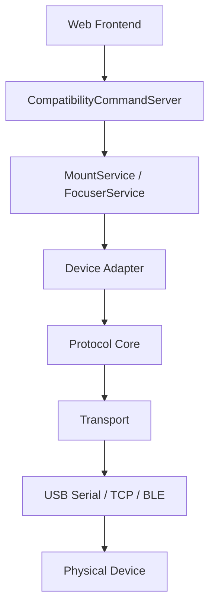

# QUARCS Android 硬件支持统一架构设计

> 适用工程：`/home/q/workspace/QUARCS_app_andorid`
>
> 目标：为 Android 直连硬件建立一套统一、可扩展、可渐进迁移的本地设备支持架构。
>
> 当前样板设备：
> - 赤道仪：`OnStep`
> - 电调焦：`QFocuser`

## 1. 背景

当前 Android 端已经完成前端内嵌、本地 HTTP 服务和本地 WebSocket 兼容命令服务的打通。后续重点不再是“把旧服务端整体搬到 Android”，而是把硬件能力按设备域逐步迁移到 Android 原生实现。

现阶段硬件大体分为两类：

1. 相机
   - 优先考虑厂商 SDK 路线，例如 QHYCCD Android 支持。
2. 非相机硬件
   - 典型包括赤道仪、电调焦、滤镜轮、导星接口等。
   - 过去主要依赖 INDI 生态。

对于 Android 手机直连硬件场景，非相机硬件不建议把 `indiserver + driver + property` 整体搬入 App，而建议采用：

- Android 原生连接层
- 精简后的设备协议核心
- 面向产品业务的统一设备接口
- 与现有 `MountService`、`FocuserService` 等服务衔接

## 2. 本文结论

统一架构建议采用以下四层：

1. `Transport` 层
2. `Protocol/Core` 层
3. `Device Adapter` 层
4. `Service` 层

其核心原则是：

- 连接方式与设备协议分离
- 设备协议与产品业务接口分离
- 单一设备核心只负责单一设备域
- 优先抽取 INDI 中有价值的协议逻辑，不复用沉重的设备类外壳
- 与现有前端兼容协议保持衔接，降低迁移风险

## 3. 设计目标

### 3.1 需要解决的问题

- Android 需要直接连接 USB、USB 转串口、Wi-Fi、蓝牙类设备。
- 不同设备厂商的协议差异很大，但上层业务动作高度相似。
- 现有前端已经依赖一批稳定的兼容命令，不适合频繁翻修。
- 后续会持续增加新的赤道仪、调焦器等设备，必须避免“一设备一套架构”。

### 3.2 架构目标

- 为赤道仪和调焦器建立统一的 Android 硬件支持框架。
- 允许不同设备共享连接层、错误模型和状态模型。
- 允许不同品牌设备分别实现自己的协议核心。
- 让 `MountService`、`FocuserService` 只依赖统一接口，不直接依赖具体品牌实现。
- 支持渐进式接入，先做最小可行能力，再补高级特性。

### 3.3 非目标

- 本文不覆盖相机 SDK 详细设计。
- 本文不要求在第一阶段保留 INDI property、面板或 XML 协议。
- 本文不要求第一阶段支持所有 INDI 已支持设备。
- 本文不要求第一阶段实现 OnStep 板载 focuser、rotator、weather 等扩展能力。

## 4. 总体分层

### 4.1 逻辑分层图



### 4.2 推荐目录层级

```text
QUARCS_app_andorid/
  hardware/
    transports/
      transport_interface.*
      usb_serial_transport.*
      tcp_transport.*
      ble_transport.*              # 后续可选
    core/
      mount/
        onstep/
          onstep_mount_protocol.*
          onstep_mount_core.*
      focuser/
        qfocuser/
          qfocuser_protocol.*
          qfocuser_core.*
    adapters/
      mount/
        mount_device_interface.*
        onstep_mount_adapter.*
      focuser/
        focuser_device_interface.*
        qfocuser_adapter.*
  services/
    mountservice.*
    focuserservice.*
```

### 4.3 每层职责

#### L1. `Transport`

负责“怎么连接设备”，不负责天文业务语义。

典型职责：

- 打开和关闭连接
- 发送和接收原始数据
- 超时控制
- 缓冲区清理
- 串口参数设置
- USB 权限与热插拔管理
- TCP 重连

典型实现：

- `UsbSerialTransport`
- `TcpTransport`
- `BleTransport`

不应承担的职责：

- 不解析 RA/DEC
- 不理解 Goto、Park、FocusMove
- 不负责产品级命令返回格式

#### L2. `Protocol/Core`

负责“设备协议和状态机”，不负责 Android 权限与 UI 命令映射。

典型职责：

- 握手
- 命令封包
- 响应解析
- 状态轮询
- 设备能力探测
- 错误码映射
- 设备域核心业务逻辑

典型实现：

- `OnStepMountCore`
- `QFocuserCore`

不应承担的职责：

- 不直接依赖 `MountService` / `FocuserService`
- 不直接依赖 WebSocket 消息结构
- 不直接依赖 Android Activity 生命周期
- 不直接依赖 INDI property 体系

#### L3. `Device Adapter`

负责把具体品牌协议核心转换为产品内部的统一设备接口。

典型职责：

- 把 `OnStepMountCore` 暴露为 `IMountDevice`
- 把 `QFocuserCore` 暴露为 `IFocuserDevice`
- 统一状态字段
- 统一错误语义
- 屏蔽底层品牌差异

#### L4. `Service`

负责把产品业务命令转成统一设备接口调用，并返回前端兼容结果。

典型职责：

- `MountService`
- `FocuserService`
- 与 `CompatibilityCommandServer` 协作
- 保持现有命令协议风格
- 处理业务级节流、缓存、状态同步

## 5. 横切设计原则

### 5.1 单域单核心

每个设备核心只负责一个设备域：

- `OnStepMountCore` 只负责 mount
- `QFocuserCore` 只负责 focuser

即使某块板子物理上集成了多种能力，也不应在第一阶段把所有能力揉进一个核心类里。

### 5.2 去 INDI 框架化，保留协议价值

对 INDI 的复用策略应为：

- 保留命令格式、响应解析、协议经验、状态机逻辑
- 弃用 `indiserver`
- 弃用 `DefaultDevice`
- 弃用 `INDI::Telescope` / `INDI::Focuser` 外壳
- 弃用 property / panel / XML 风格接口

换言之：

- 复用 `core`
- 不复用 `shell`

### 5.3 统一错误语义

建议产品内统一错误模型，例如：

- `PermissionDenied`
- `DeviceNotFound`
- `OpenFailed`
- `HandshakeFailed`
- `Timeout`
- `ProtocolError`
- `Unsupported`
- `Busy`
- `Disconnected`

这样 `Service` 层不需要为每个品牌写一套错误翻译。

### 5.4 状态优先于命令回显

上层服务不应只依赖“命令是否发送成功”，还应维护明确的设备状态快照。

建议统一维护：

- 连接状态
- 最近错误
- 最近轮询时间
- 当前目标值
- 当前实际值
- 当前是否忙碌

## 6. `OnStep` 统一样板设计

### 6.1 设计定位

将 `OnStep` 收敛为单一赤道仪样板：

- 名称建议：`OnStepMountCore`
- 第一阶段只覆盖 mount 能力
- 不实现板载 focuser、rotator、weather、outputs 等扩展

### 6.2 为什么要提纯

现有 `lx200_OnStep` 的复杂度主要来自两部分历史原因：

1. 协议上复用了 `LX200` 体系，因此继承链深，带入了大量历史代码。
2. 硬件侧承载了多个设备域，导致一个驱动同时包含 mount、focuser、rotator、weather 等职责。

对 Android 直连场景而言，这种结构过重，不利于：

- 控制继承关系
- 划清职责边界
- 稳定调试
- 渐进演进

### 6.3 推荐保留的核心能力

第一阶段建议只保留：

- `connect`
- `handshake`
- `getVersion`
- `getRaDec`
- `getMountStatus`
- `gotoRaDec`
- `syncRaDec`
- `park`
- `unpark`
- `abort`
- `moveNorthSouth`
- `moveEastWest`
- `setTrackingEnabled`
- `setSlewRate`
- `setGuideRate`（可选）

### 6.4 第一阶段暂不纳入

- 板载 focuser
- rotator
- weather
- outputs
- alignment 高级配置
- 多 focuser 探测
- 各类面向 INDI/Ekos 的扩展属性

### 6.5 `OnStep` 核心拆分建议

```text
OnStepMountCore
  ├─ uses OnStepMountProtocol
  ├─ uses ITransport
  └─ exposes IMountDevice semantics
```

建议职责划分如下：

- `OnStepMountProtocol`
  - 拼接 `:G...#`、`:S...#`、`:M...#` 等命令
  - 解析单字符、整数、浮点、长文本响应
- `OnStepMountCore`
  - 维护当前状态
  - 调度轮询
  - 处理握手和版本判定
  - 提供 mount 级动作接口
- `OnStepMountAdapter`
  - 实现 `IMountDevice`
  - 对接 `MountService`

### 6.6 对 INDI 代码的复用策略

建议复用：

- 命令格式
- 响应解析 helper
- 状态判定经验
- 与 `LX200` 协议兼容的有效命令

不建议复用：

- `LX200Generic`
- `LX200Telescope`
- `INDI::Telescope`
- `WeatherInterface`
- `RotatorInterface`
- 现有 property 定义逻辑

## 7. `QFocuser` 统一样板设计

### 7.1 设计定位

将 `QFocuser` 作为标准单一电调样板：

- 名称建议：`QFocuserCore`
- 第一阶段走单设备、单协议、单设备域路线
- 主要承载 focuser 能力

### 7.2 为什么适合作为样板

`QFocuser` 的协议集中、边界清晰，非常适合作为 Android 原生硬件支持的模板案例：

- 命令封包明确
- JSON 响应结构稳定
- 串口交互模式单纯
- 业务动作集中在 focuser 语义上

### 7.3 推荐保留的核心能力

- `connect`
- `handshake`
- `getVersion`
- `getPosition`
- `moveAbsolute`
- `moveRelative`
- `abort`
- `syncPosition`
- `setSpeed`
- `setReverse`
- `getTemperature`（可选）

### 7.4 第一阶段可后置能力

- hold current
- PDN mode
- 更细的温度显示选项
- 一切偏面板配置性质的扩展项

### 7.5 `QFocuser` 核心拆分建议

```text
QFocuserCore
  ├─ uses QFocuserProtocol
  ├─ uses ITransport
  └─ exposes IFocuserDevice semantics
```

建议职责划分如下：

- `QFocuserProtocol`
  - 生成 JSON 命令
  - 解析 JSON 响应
  - 统一命令编号语义
- `QFocuserCore`
  - 维护目标位置与当前状态
  - 处理握手
  - 执行相对/绝对移动
  - 管理轮询
- `QFocuserAdapter`
  - 实现 `IFocuserDevice`
  - 对接 `FocuserService`

### 7.6 对 INDI 代码的复用策略

建议复用：

- JSON 命令构造逻辑
- 响应字段语义
- 握手和轮询经验
- 位置/速度/同步/反向语义

不建议复用：

- `INDI::Focuser`
- `FocuserInterface`
- property 定义和状态同步逻辑
- `TimerHit`
- 依赖 `PortFD + tty_*` 的直接串口层

## 8. 统一设备接口建议

## 8.1 `IMountDevice`

建议统一接口如下：

```cpp
struct MountState {
    bool connected;
    bool slewing;
    bool tracking;
    bool parked;
    double raHours;
    double decDegrees;
    double targetRaHours;
    double targetDecDegrees;
    QString lastError;
};

class IMountDevice {
public:
    virtual ~IMountDevice() = default;
    virtual bool connect() = 0;
    virtual void disconnect() = 0;
    virtual MountState state() const = 0;
    virtual bool gotoRaDec(double raHours, double decDegrees) = 0;
    virtual bool syncRaDec(double raHours, double decDegrees) = 0;
    virtual bool park() = 0;
    virtual bool unpark() = 0;
    virtual bool abort() = 0;
    virtual bool setTrackingEnabled(bool enabled) = 0;
    virtual bool moveNorthSouth(bool north, bool start) = 0;
    virtual bool moveEastWest(bool east, bool start) = 0;
};
```

## 8.2 `IFocuserDevice`

建议统一接口如下：

```cpp
struct FocuserState {
    bool connected;
    bool moving;
    int position;
    int targetPosition;
    int speed;
    bool reversed;
    double temperature;
    QString lastError;
};

class IFocuserDevice {
public:
    virtual ~IFocuserDevice() = default;
    virtual bool connect() = 0;
    virtual void disconnect() = 0;
    virtual FocuserState state() const = 0;
    virtual bool moveAbsolute(int position) = 0;
    virtual bool moveRelative(bool outward, int steps) = 0;
    virtual bool abort() = 0;
    virtual bool syncPosition(int position) = 0;
    virtual bool setSpeed(int speed) = 0;
    virtual bool setReverse(bool enabled) = 0;
};
```

## 9. 与现有服务层的映射

### 9.1 `MountService`

现有 `MountService` 已经具备命令入口，后续建议映射到统一 `IMountDevice`：

- `getMountParameters`
  - 返回连接状态、停车状态、跟踪状态、当前位置、速度信息
- `MountMoveWest`
  - 调用 `moveEastWest(false, true/false)` 或对应封装
- `MountMoveEast`
  - 调用 `moveEastWest(true, true/false)`
- `MountMoveNorth`
  - 调用 `moveNorthSouth(true, true/false)`
- `MountMoveSouth`
  - 调用 `moveNorthSouth(false, true/false)`
- `MountMoveAbort`
  - 调用 `abort()`
- `MountPark`
  - 调用 `park()`
- `MountTrack`
  - 调用 `setTrackingEnabled()`
- `MountHome`
  - 如果设备支持，映射到 home 动作；不支持则返回明确错误
- `MountSYNC`
  - 调用 `syncRaDec()`
- `MountGoto`
  - 调用 `gotoRaDec()`
- `MountSpeedSwitch`
  - 调用速率切换

### 9.2 `FocuserService`

后续建议映射到统一 `IFocuserDevice`：

- `getFocuserParameters`
  - 返回位置、速度、温度、反向状态、连接状态
- `focusSpeed`
  - 调用 `setSpeed()`
- `focusMove`
  - 调用 `moveRelative()` 或 `moveAbsolute()`
- `AutoFocus`
  - 第一阶段不放进设备核心，建议作为更上层自动流程
- `StopAutoFocus`
  - 更适合作为自动流程控制，不直接绑定硬件协议
- `AutoFocusConfirm`
  - 同样建议留在上层工作流

## 10. 生命周期与运行时建议

### 10.1 连接管理

建议统一支持以下状态：

- 未连接
- 正在连接
- 已连接
- 正在断开
- 连接失败
- 连接丢失

### 10.2 轮询策略

建议设备核心内部支持轻量轮询，但轮询周期应由上层可配置。

示例：

- mount：500ms 到 1000ms
- focuser：200ms 到 500ms

### 10.3 断线恢复

建议约定：

- `Transport` 负责检测 I/O 失败
- `Core` 负责进入 `Disconnected/Error` 状态
- `Service` 决定是否自动重连和如何上报前端

## 11. 第一阶段实施建议

### 11.1 优先顺序

推荐顺序：

1. 先落地统一 `Transport` 抽象
2. 再做 `QFocuserCore`
3. 再做 `OnStepMountCore`
4. 接入 `FocuserService`
5. 接入 `MountService`

原因：

- `QFocuser` 更简单，适合先验证架构
- `OnStep` 更复杂，适合在统一框架成熟后接入

### 11.2 每个样板的最小闭环

`QFocuser` 最小闭环：

- 连接
- 握手
- 读位置
- 绝对移动
- 停止

`OnStep` 最小闭环：

- 连接
- 握手
- 读 RA/DEC
- Goto
- 停止
- 跟踪开关

## 12. 后续扩展方向

在该架构稳定后，可继续扩展：

- 更多 mount 协议核心
  - `LX200` 其他派生设备
  - `SynScan`
  - `Celestron AUX`
- 更多 focuser 协议核心
  - 其他串口调焦器
  - USB HID 调焦器
- 设备发现层
  - USB 设备枚举
  - 局域网设备发现
- 统一诊断层
  - 原始命令日志
  - 设备能力探测报告
  - 连接故障定位

## 13. 最终建议

对于 Android 直连硬件，统一架构应明确坚持以下路线：

- 上层延续现有 `CompatibilityCommandServer -> *Service` 思路
- 中层引入统一 `Device Adapter`
- 底层以 `Protocol/Core + Transport` 承接不同设备
- `OnStep` 作为单一 mount 样板
- `QFocuser` 作为单一 focuser 样板
- 复用 INDI 的协议经验，不复用 INDI 的重型设备框架

这样做的收益是：

- 架构边界清晰
- 迁移风险可控
- 新品牌接入成本可预估
- 与前端兼容协议保持稳定
- 更符合 Android 手机直连设备的运行模型
